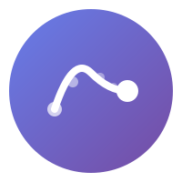

# Welcome to TeleCursor

<p align="center">
  
</p>

<p align="center">
  <strong>Open cursor intelligence infrastructure</strong><br>
  Building the first public dataset of human cursor behavior
</p>

---

## 🎯 What is TeleCursor?

TeleCursor creates **CursorNet** — the first open dataset capturing the full physics of human cursor movement as people browse the web. Unlike existing datasets that only track clicks or provide aggregated heatmaps, TeleCursor records complete trajectories: every curve, hesitation, acceleration, and pause.

**The vision:** Enable AI models that understand how humans actually navigate digital interfaces — at the motor level.

<div class="grid cards">

<div class="card">

### 📡 Collect

A browser extension that captures cursor physics with local differential privacy

[Get the Extension →](browser-extension/)

</div>

<div class="card">

### 🧠 Train

Three-stage model training from raw cursor dynamics to task reasoning

[Models Documentation →](models/)

</div>

<div class="card">

### 🔒 Protect

Privacy-first architecture with DP-SGD, k-anonymity, and user consent

[Privacy Policy →](privacy/)

</div>

<div class="card">

### 🤝 Govern

Community-owned infrastructure via Cursor Commons

[Governance →](governance/)

</div>

</div>

---

## 🚀 Quick Start

### 1. Install the Extension

```bash
# Clone the repository
git clone https://github.com/noobsmoker/telecursor.git
cd telecursor

# Load in Chrome
# chrome://extensions → Developer mode → Load unpacked → browser-extension/
```

### 2. Run the Server

```bash
cd server
npm install
npm start
# Server runs on http://localhost:3000
```

### 3. Contribute Data

Open the extension, grant consent, and start browsing. Your cursor data contributes to the public dataset.

---

## 📊 Dataset Schema

```json
{
  "trajectory_id": "uuid-v4",
  "session_context": {
    "domain": "github.com",
    "viewport": { "width": 1920, "height": 1080 },
    "device_type": "desktop"
  },
  "samples": [
    { "t": 0, "x": 145.5, "y": 892.0, "vx": 0.0, "vy": 0.0 }
  ],
  "interaction_events": [
    { "t": 1250, "type": "hover_start", "target": { "role": "link" } }
  ]
}
```

[Full Schema →](api/schema/)

---

## 🛡️ Privacy Guarantees

| Layer | Protection |
|-------|------------|
| **Client-side** | Laplace noise, temporal subsampling |
| **Training** | DP-SGD (ε ≤ 3.0) |
| **Storage** | k-anonymity (k ≥ 5) |
| **User control** | Granular consent, data export, deletion |

[Privacy Deep Dive →](privacy/)

---

## 📈 Public Stats

The dataset grows with every contribution. View live statistics:

- **Total Sessions:** Growing
- **Sample Count:** [API Endpoint](/api/v1/stats)
- **Domain Distribution:** [Leaderboard](/api/v1/stats/leaderboard)

---

## 🤝 Contributing

We need contributors at every level:

- **Users:** Install the extension and contribute data
- **Developers:** Build features, fix bugs
- **Researchers:** Use the dataset for papers
- **Advocates:** Spread the word

[Contributing Guide →](contributing/)

---

## 📜 License

| Component | License |
|-----------|---------|
| Code | Apache 2.0 |
| Models | OpenRAIL-M |
| Data | CC-BY-SA |

---

*TeleCursor is a project of [Cursor Commons](governance/) — community-owned, privacy-first, open forever.*